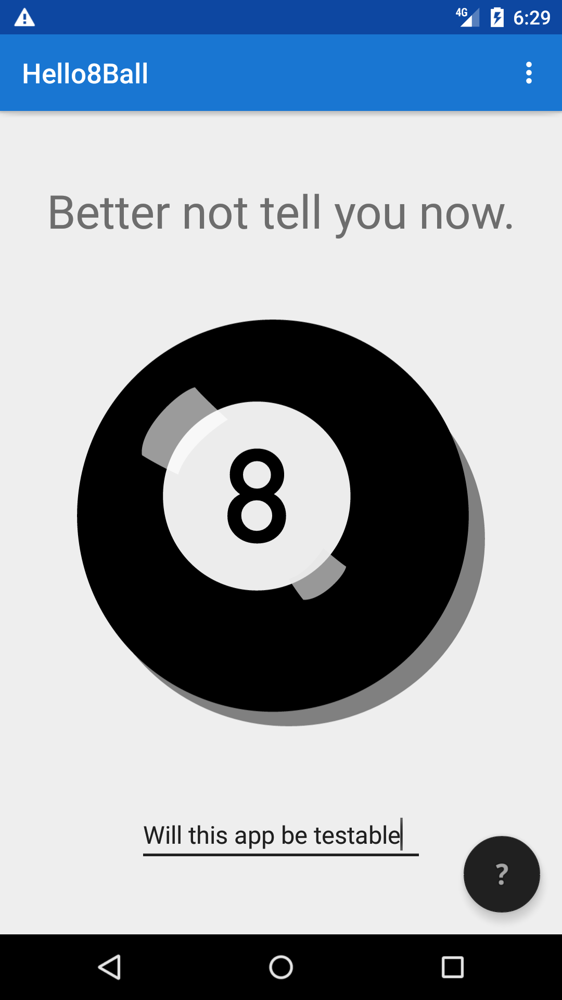

# Hello8Ball

A Magic 8 Ball app to use a sampler to explore Kotlin testing. The app works as a magic 8 ball.

## How to run

Import the build.gradle in the root folder into Android Studio latest canary. Run the app.

Or

`./gradlew assembleDebug` and find the apk in `app/build/outputs/apk/debug`

## How to test

Run the tests in Android studio or use the command line.

### Unit tests

`./gradlew test`

### Instrumented tests

`./gradlew connectedAndroidTest`

